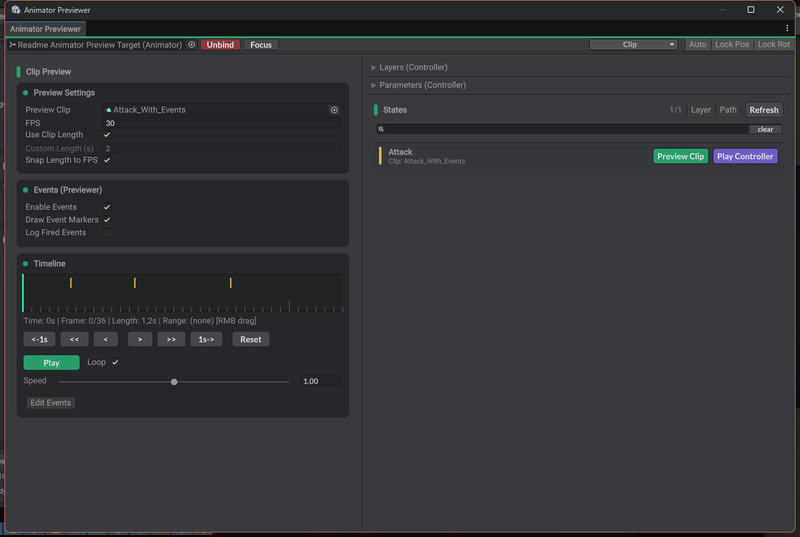

# Animator Previewer

Unity editor tooling for deterministic animation preview workflows.

## What It Does

- Previews animation clips and animator controllers from an editor window.
- Scrubs and plays timelines without entering Play Mode.
- Displays controller layers, states, parameters, events, and active clip context.
- Inspects and edits animation events without jumping between clips, inspectors, and timeline positions.
- Restores preview pose and prefab override state when unbinding or closing.
- Bridges particle systems through the editor particle preview driver for FX scrubbing.

## Usage

Open `Window > Animation > Animator Previewer`.

1. Select or assign an `Animator`.
2. Bind the previewer to the target.
3. Choose clip or controller preview mode.
4. Scrub, play, inspect states/events, or edit clip events.
5. Unbind or close the window to restore the previewed object state.

## Animation Events

Animator Previewer is built around making animation events less painful to author and debug.

- Shows the events for the active clip while you scrub or preview it.
- Lets you edit event time, function name, and supported parameters from the preview window.
- Tracks pending event edits so closing, rebinding, recompiling, or entering Play Mode does not silently discard changes.
- Refreshes preview context after event writes so event-driven FX and callbacks can be tested immediately.

This is especially useful for attack frames, footstep callbacks, VFX spawn points, sound triggers, and other frame-sensitive gameplay hooks.

## Timeline And Controller Preview

- Clip mode gives direct FPS, length, loop, event-marker, and frame stepping controls.
- Controller mode keeps layer, parameter, state, and active clip context visible while previewing an Animator Controller.
- Particle preview integration keeps edit-mode FX scrubbing deterministic alongside animation playback.

## Notes

- The tool is editor-only.
- Preview safety is intentionally conservative around play mode changes, recompilation, and asset saves.
- Particle preview integration is optional from a workflow perspective, but included in the package dependency graph.
