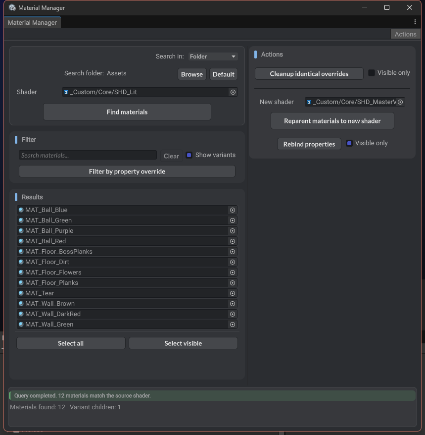

# Material Manager

Unity editor tooling for shader material maintenance.

## What It Does

- Finds project or scene materials using a selected source shader.
- Filters material results by name, tags, variant visibility, or overridden shader property.
- Reverts material variant overrides that are identical to their parent value.
- Reparents material variant chains to another shader/root material.
- Rebinds compatible shader property values during shader migration.

## Usage

Open `Tools > Material Manager`.

1. Choose `Scene` or `Folder` search scope.
2. Assign a source shader and click `Find Materials`.
3. Refine the results with search, variant visibility, or property filtering.
4. Use the action panel for cleanup or shader migration operations.

## Cleanup And Migration

- Use `Revert` to remove variant overrides that already match the parent material value.
- Use `Rebind` to copy compatible source shader property values onto the target shader.
- Use `Reparent` to move selected material variants under another shader/root material.
- Use `Visible only` options after filtering when you want actions to apply to a narrowed result set.

## Search Queries

MaterialManager treats material names as tag-like text. Separators such as `_`, `-`, and spaces split the name into searchable tags.

Examples:

- `fire` matches `MAT_fire_elite`, `mat-fire`, or `fire material`.
- `fire elite` requires both `fire` and `elite` tags.
- `fire -ice` requires `fire` and excludes any tag containing `ice`.
- `mat_fire` can still match the full material name directly.

Use short, consistent material name tags to make large shader migrations easier to narrow down.
